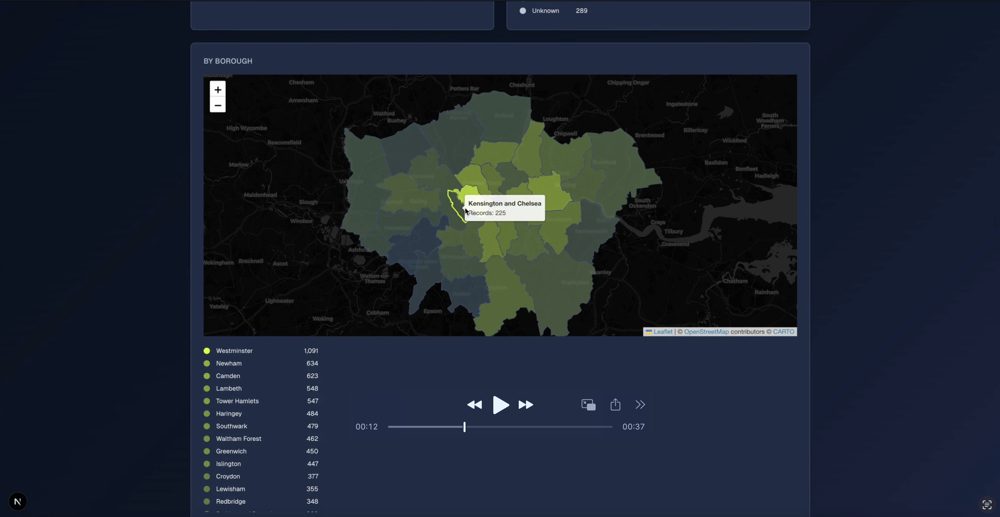

# Metropolitan Police Service stop and search data visualisation

## Overview

# [Live demo](https://london-stop-search.vercel.app/)

[](https://youtu.be/XDT4HxAnqUQ)

## Choice of tools

### React framework - NextJS

A requirement of the task and my personal choice. Allows frontend and backend development in the same app and repo. Many performance optimisations including SSR.

### Object Notation - Typescript

Allows typesafe development; alternatives: ES6

### Data visualisation framework - D3

A long term personal preference allows deep flexibility in presenting data visually.

### Component Library, visual testing: Storybook

Allows components to be tested and visualised in isolation.

### Redux state management: MOBX State tree


## Data Breakdown

```json
    {
        "age_range": "18-24", 
        "officer_defined_ethnicity": null, 
        "involved_person": true, 
        "self_defined_ethnicity": "Other ethnic group - Not stated", 
        "gender": "Male", 
        "legislation": null, 
        "outcome_linked_to_object_of_search": null, 
        "datetime": "2024-01-06T22:45:00+00:00", 
        "outcome_object": {
            "id": "bu-no-further-action", 
            "name": "A no further action disposal"
        }, 
        "location": {
            "latitude": "52.628997", 
            "street": {
                "id": 1738518, 
                "name": "On or near Crescent Street"
            }, 
            "longitude": "-1.130273"
        }, 
        "object_of_search": "Controlled drugs", 
        "operation": null, 
        "outcome": "A no further action disposal", 
        "type": "Person and Vehicle search", 
        "operation_name": null, 
        "removal_of_more_than_outer_clothing": false
    },
```


## Design

Looking at the data I would like to create a tool that allows freeform exploration of the data. The data is naturaly sequenced chronolically and has multiple cross-sections to explore. Therefore in terms of information heirarchy; I'd thave the time-range in view at the top; along with controls to move in or out of the time-range as well as move side to side. Then each cross-section should be broken down as cells with appropriate visualisations. Clicking into these should futher focus the visualisation as a filter to the dataset.

### Data Heirarchy


### Main Layout

```html
      <main className="flex flex-col gap-[32px] row-start-2 items-center sm:items-start">
      
        <div className="flex flex-col gap-[32px]">
          <h1 className="text-4xl font-bold">Metropolitan Police Service - Stop and Search</h1>
        </div>

        <DataScopedTitle></DataScopedTitle>

        <DateRangeExplorer></DateRangeExplorer>

        <Filters></Filters>

        <div className="grid grid-cols-2 gap-[32px]">

          <NumberOfSearches></NumberOfSearches>
          <AgeRange></AgeRange>
          <Ethnicity></Ethnicity>
          <Gender></Gender>
          <Outcome></Outcome>
          <Location></Location>
          <ObjectOfSearch></ObjectOfSearch>
          <SearchType></SearchType>
          <RemovalOfMoreThanOuterClothing></RemovalOfMoreThanOuterClothing>

        </div>

      </main>
```

## Implementation

### 1 Creation of main layout ✅

### broken down into components per cross-section
### Storybook stories for each compoenent

### 2 Function to extract entire data-set ✅

### 3 Create and refine visualisations per cross-section ✅

#### Data scoped title ✅

#### Date Range ✅

##### Design


#### Number of searches ✅
#### Age range ✅
#### Ethnicity ✅
#### Gender ✅
#### Outcome ✅
#### Location ✅
#### Object of search 
#### Search Type
#### Removal of more than outer clothing

A sub-selection of the components were created due to time-contstaints.

### 4 Optimisation of data-set ✅

Once the needs from the dataset has been established with the UI components the data can be optimised for performance. For a larger for an enterprise i'd use a database such as Postgres with indexing. For this project I wanted to keep it as self-contained and high-performance as possible. With some experimentation I found that it was possible to create an optimised datafile that reduced the data size from 350mb to 31mb and thus be used in memory on the client and also support the cross-filtering needed by the UI. This results in a very fast and responsive UI.

### 5 Refinement of UI ✅

Improve readability; presentation of data

## Data Processing

The project includes automated scripts to download, enrich, and normalize the London Stop Search data:

### Quick Start

To process all data in one command:

```bash
npm run process-all-data
```

This runs the complete pipeline:
1. **Download** - Fetches raw data from police.uk API
2. **Enrich** - Adds borough information using geospatial lookup
3. **Normalize** - Creates optimized data structure for client-side performance

### Individual Steps

You can also run each step individually:

```bash
# Step 1: Download raw data
npm run download-data

# Step 2: Enrich with borough data
npm run enrich-data

# Step 3: Normalize for performance
npm run normalize-data
```

### Data Flow

- **Raw data**: `./data/` (350MB+ JSON files from police.uk API)
- **Enriched data**: `./data-enriched/` (with borough information added)
- **Normalized data**: `./public/data-normalized.json` (30MB optimized file)


## Deployment

1. Sign up or log in to [Vercel](https://vercel.com/).

2. Install the Vercel CLI:
   ```bash
   npm install -g vercel
   ```

3. Deploy the project:
   ```bash
   vercel
   ```

4. Follow the prompts to link the project to your Vercel account and select the appropriate settings.

5. Once deployed, visit your Vercel dashboard to manage your deployment.